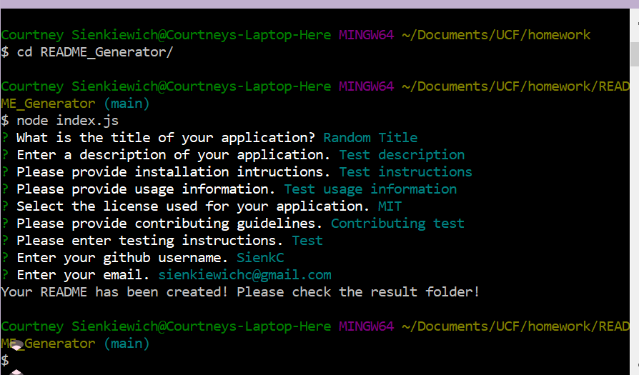
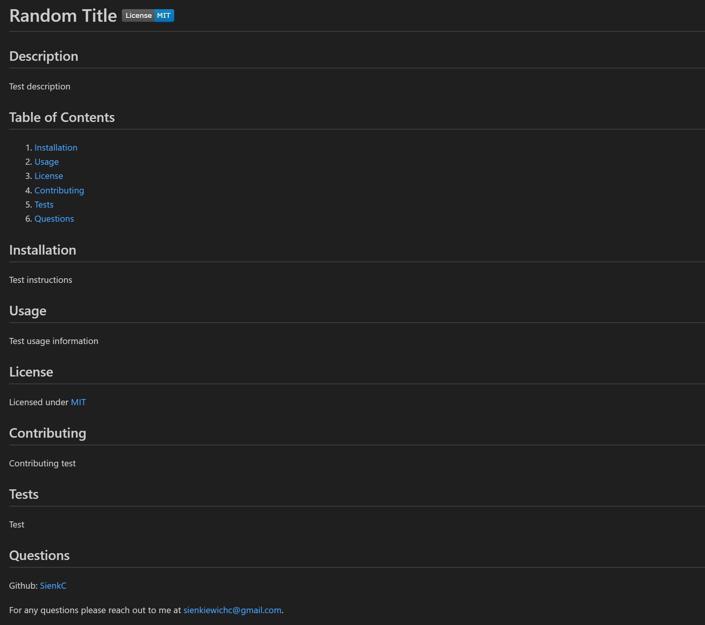

# README Generator    

  ## Description

  README Generator was created for UCF bootcamp class as an application to make creating a README file easier. The user will go through questions about their project and after they are all answered, a README.md will be created using that content. The application was designed to go along with learning and display student ability to utilize knowledge on JavaScript and node.js.

  ## Table of Contents

  1. [Installation](#installation)
  2. [Usage](#usage)
  3. [License](#license)
  4. [Contributing](#contributing)
  5. [Tests](#tests)
  6. [Questions](#questions)

  ## Installation 

  N/A

  ## Usage 

  To use the README Generator, type "node index.js" in the terminal to bring up questions. Answer each question as it appears. Any questions left blank will automatically fill in with "N/A". Once all questions have been answered, a README.md file will have been created using the information entered. The file will appear in a folder titled "result".

  Screenshot of Example in Terminal:
  

  Screenshot of Result from Above Example:
  

  ## Credits

  Base code provided by the boot camp creators at [UCF Boot Camps](https://bootcamp.ce.ucf.edu/).

  ## License 

  Licensed under [MIT](LICENSE)

  ## Contributing 

  To contribute, fork the project into your GitHub account and create a pull request.

  ## Tests 

  Type "node index.js" into the terminal.

  ## Questions 

  Github: [SienkC](https://github.com/SienkC)
  
  For any questions please reach out to me at sienkiewichc@gmail.com.

